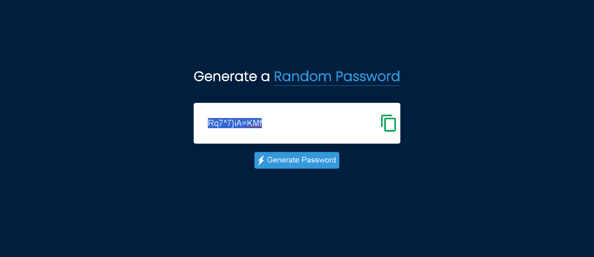

- This project is made using HTML, CSS and Javascript, it basically generates a random password of 12 length comprising of uppercase,lowercase, numbers and symbols.
- The password then can be copied and be used anywhere you want to use

  

